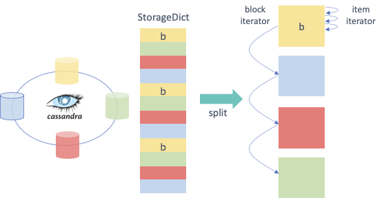

.. _basics:

The basics
==========

In this chapter we describe in detail the interface provided by the Hecuba. We also illustrate how the supported data types and operations can be applied.

Supported Data Types and Collections
************************************

Immutable types supported:
--------------------------

Data types
^^^^^^^^^^^

* ``str``, ``bool``, ``decimal``, ``float``, ``int``, ``blob``, ``tuple``, ``buffer``.

* ``double`` floating point numbers will be stored as double precision numbers.

Collections
^^^^^^^^^^^

* ``numpy.ndarray``.
* ``frozenset`` supported in StorageObj only.

Mutable collections supported:
------------------------------

* ``dict``.

* ``set`` Subject to restrictions, supported only by StorageDict (development underway).

* ``list`` to group a set of values for a given key in a StorageDict. E.g. ``dict[0] = [1,2,3]``.

Hecuba Data Classes
*******************

Storage Object
--------------

The *StorageObj* is the simplest abstraction provided by Hecuba. It acts like a ``namedtuple``, or a ``dataclass``, where the user can define attributes and access them. However, in this case, the user can choose which attributes will be persisted to the data store.

To declare instances of the StorageObj, the user first needs to define a class inheriting from the *StorageObj* as well as define the data model of the persistent attributes. The format of the data model is a Python comment with one line per attribute. Each line must start with the keyword *@Classfield* and continue with the name of the attributes and its data type specification.

.. code-block:: python

    class ClassName(StorageObject):
        '''
        @ClassField attribute_name attribute_type
        '''

For example, the following code shows the definition of a class containing an attribute of type integer.

.. code-block:: python

    class MyClass(StorageObj):
        '''
        @ClassField MyAttribute_1 int
        '''

When the user needs to use collections as attributes, the syntax needs to be further elaborated. For example, to define a Python dictionary it is necessary to specify the type of the keys and the type of the values. In this case, after the attribute type we can find the rest of the specifications within angular brackets.

.. code-block:: python

    class ClassName(StorageObj):
        '''
        @ClassField attribute_name attribute_type <attribute_type_specification>
        '''

For example, the following code adds a dictionary attribute: the key is of type ``Integer`` and the value a ``str``.

.. code-block:: python

    class MyClass(StorageObj):
        '''
        @ClassField MyAttribute_1 int
        @ClassField MyAttribute_2 dict <<int>, str>
        '''

Each additional level required to complete a specification type can be added within angle brackets. For example, the following code adds the specification of a dictionary that has a key of type tuple, which is composed of an ``Integer`` and a ``str``, and that has a value of type ``Integer``.

.. code-block:: python

    class MyClass(StorageObj):
        '''
        @ClassField MyAttribute_1 int
        @ClassField MyAttribute_2 dict <<int>, str>
        @ClassField MyAttribute_3 dict <<int, str>, int>
        '''

Attributes of type ``dict`` allow the programmer to assign a name to each component of the dictionary (keys and values). These names can help users to give semantic meaning to the data, for instance when accessing the results of a dictionary or when exploring the persistent data with external tools.

.. code-block:: python

    class MyClass(StorageObj):
        '''
        @ClassField MyAttribute_1 int
        @ClassField MyAttribute_2 dict <<int>, str>
        @ClassField MyAttribute_3 dict <<int, str>, int>
        @ClassField MyAttribute_4 dict <<mykey1:int, mykey2:str>, myvalue:int>
        '''

Storage Dictionary
------------------

The *StorageDict* abstracts the underlying data model and exposes the user interface of a python ``dict``. The mechanism to create instances of a *StorageDict* is the same as the *StorageObj*. A class that inherits from the *StorageDict* must be defined, and an annotation describing the data model of the keys and values added.

The data model definition must start with the keyword *@TypeSpec* and continue with the type of the keys, and the values.

.. code-block:: python

    class ClassName(StorageDict):
        '''
        @TypeSpec dict <<keys_specification>values_specification>
        '''

For example, the following code shows the definition of a dictionary with one key of type ``Integer`` and a ``str`` value.

.. code-block:: python

    class MyClass(StorageDict):
        '''
        @TypeSpec dict<<int>, str>
        '''

Also, the user can set names to the keys and values to give semantic meaning.
It might be desirable to access the results of a dictionary by their name, or when exploring the persistent data with external tools.

.. code-block:: python

    class MyClass(StorageDict):
        '''
        @TypeSpec dict<<mykey1:int>, myvalue:str>
        '''

Additional keys or values can be added to a *StorageDict* definition.

.. code-block:: python

    class MyClass(StorageDict):
        '''
        @TypeSpec dict<<mykey1:int, mykey2:str>, myvalue1:int, myvalue2:int, myvalue3:str>
        '''

Distributed sets inside a StorageDict
^^^^^^^^^^^^^^^^^^^^^^^^^^^^^^^^^^^^^

The usage of distributed sets is a bit restricted.
When they a set is used in a StorageDict, the persistent object cannot have more attributes than a single set.
The set contains all the persistent storage funcionalities for sets, for example:

.. code-block:: python

    from hecuba import StorageDict
    class DictWithSet(StorageDict):
        '''
        @TypeSpec dict<<k1:str, k2:int>, s1:set<int>>
        '''

    my_data = DictWithSet("my_app.my_data")
    my_data["1", 1] = {1}
    my_data["2", 2] = {1, 2, 3}
    my_data["2", 2].remove(2)
    other_data = DictWithSet("my_app.other_data")
    other_data["2", 2] = my_data["2", 2].union(my_data["1", 1])
    for key, set_value in other_data.items():
        if not 2 in set_value:
            other_data[key].add(2)

Cross-class referencing
-----------------------

A previously defined class can be referenced in the definition of a newer class.
For instance, a custom StorageObj can have an attribute of type "MyClass", and the latter, be a custom class that inherits from a StorageObj or StorageDict.

The same is possible the other way around, a StorageDict can have as value(s) other StorageDicts or StorageObjs.
In order to do so, the programmer needs to specify the data model of both:

.. code-block:: python

    # file is named classes.py
    from hecuba import StorageDict, StorageObj
    class MyObj(StorageObj):
        '''
        @ClassField a int
        @ClassField b str
        '''

    class MyDict(StorageDict):
        '''
        @TypeSpec dict<<key:int>, my_obj:classes.MyObj>
        '''

    my_dict = MyDict("my_app.my_data")
    obj1 = MyObj()
    obj1.a = 2
    obj1.b = "hello"
    my_dict[0] = obj1

Storage Numpy
-------------

With the *StorageNumpy* class programmers can instantiate numpy ndarrays that eventually can be persisted.
Using the StorageNumpy class there is no need to define any additional class, the user can use this Hecuba class directly in the code to instantiate numpys ndarrays.
The shape of the array in inferred from the data assigned.
Programmers can instantiate volatile numpy ndarrays and make them persistent later or can instantiate persistent numpy ndarrays.
The initial value for the StorageNumpy must be passed as a parameter of the constructor.
The following fragment of code shows the different options to instantiate a StorageNumpy:

.. code-block:: python

    from hecuba import StorageNumpy
    import numpy as np
    n = StorageNumpy(np.arange(10).reshape(2,5))                  # n is a volatile StorageNumpy
    n = StorageNumpy(np.arange(10).reshape(2,5), "persistent)     # n is a persistent StorageNumpy

Once instantiated, the programmer can user the functions of the numpy library to manipulate the StorageNumpys. Hecuba retrieves from disk (if needed) the values of the numpy ndarrays:

.. code-block:: python

    from hecuba import StorageNumpy
    import numpy as np
    A=StorageNumpy(np.arange(10).reshape(2,5), "matrixA")
    B=StorageNumpy(np.arange(10).reshape(5,2), "matrixB")
    res=np.dot(A,B) #res is a voltile StorageNumpy that programmers can persist if needed

Persistent StorageNumpy are store distributed in the database.
They are splitted in blocks, transparently to the programmer.
Hecuba assigns to each block an identifier that will act as the key of the block and will decide which node holds it.

Hecuba Classes instantiation
****************************

Hecuba provides two different constructors to instantiate *StorageNumpys* and classes that inherit from *StorageObjs* and *StorageDicts*.
The first one is to instantiate new objects that have no persistent data associated, and data will be kept in-memory until the instance method *make_persistent* is called.

The second constructor is to instantiate objects that will make use of the persistent storage.
In this case, the constructor receives a string as the parameter, which is the identifier of the data inside the data store.
Hecuba checks if there already exists some persistent data with that identifier, and if it doesn’t exist Hecuba creates it.

If the identifier is already used in the data store, then Hecuba checks if the schema of that existing object matches with the object that the programmer is trying to instantiate.
If this is the case, Hecuba assumes that the programmer wants to get access to that object and completes the instantiation:
any access will be performed on the existing object.
If the schema does not match, the user code will fail with an exception.

Hecuba allows to deal with hierarchical namespaces and to specify several levels of the hierarchy with just one identifier.
For example, directory name and file name, in the case of file systems, or keyspace name and table name, in the case of Apache Cassandra.
The format of the identifier specifies that a dot must separate the identifiers of each level in the namespace.
If the identifier does not contain a dot then Hecuba interprets that the identifier refers just to the name in the lowest level in the namespace hierarchy
(there are default values for the rest of the components to identify the data that the user can configure through environment variables, see section Hecuba configuration parameters).

.. code-block:: python

    o1=MyClassName() # o1 is a volatile object

    o2=MyClassName("Table") # o2 is a persistent object: the name of the table is "Table" and the keyspace is the default name used in this execution

    o3=MyClassName("Keyspace.Table") # o3 is a persistent object: the name of the table is "Table" and the name of the keyspace is "Keyspace"

It is also possible to use the static method *get_by_alias* to instantiate an already existing persistent object.

.. code-block:: python

    o4=MyClassName.get_by_alias("Keyspace.Table")

Notice that Hecuba registers the schema of the user defined classes and thus, it is not possible to reuse those class names for a different class definition. The access code to an instance of such a redefined class will fail due to schema mismatch.

Access to Hecuba objects
************************

From the point of view of the programmers, both objects with persistent data and objects without persistent data are accessed in the same way: like regular Python objects.
However, Hecuba intercepts all accesses to a Hecuba object and executes the suitable code to refer to the involved data.
Notice that some accesses to persistent data may be solved without accessing the data store because Hecuba implements a cache to keep recently used persistent data and thus, save accesses to the data store.

.. code-block:: python

    o1=MySOClass()               # instantiation of an object without persistent data
    o1.dict_attr[0]=1            # access to a regular Python object in memory
    value1=o1.dict_attr[0]       # access to the data store to retrieve the data
    value2=o1.dict_attr[0]       # access to Hecuba cache in memory
    o2=MySOClass("Table")        # instantiation of persistent object
    o2.dict_attr[0]=2            # saved to Hecuba cache in memory, to be stored in the database later

Hecuba allows to define *StorageDicts* with more than one value.
This is implemented as a named tuple and, thus each component of the value can be referred with the name assigned in the class specification or with its positional value.

.. code-block:: python

    class MyClass(StorageDict):
        '''
        @TypeSpec dict<<mykey1:int, mykey2:str>, myvalue1:int, myvalue2:int, myvalue3:str>
        '''

    d=MyClass("dictname")        # dictname represents an already existing persistent StorageDict
    i=d[0,"value"].myvalue2      # access to the second attribute of the value corresponding with key (0,"value")
    i=d[0,"value"][1]            # access to the second attribute of the value corresponding with key (0,"value")

Making volatile data persistent
*******************************

All Hecuba volatile objects can become persistent at any point.
The programmer only needs to use the *make_persistent* method passing as parameter which will be the identifier of the object in the data store.
If the volatile object already contains data, all the data is eventually sent to the data store.
And from this point on, all the modifications on the object will be considered to be persistent.

.. code-block:: python

    o1 = MyObj()
    o1.a = 2
    o1.b = "hello"
    o1.make_persistent("myksp.mytable")

If the identifier is already used in the data store, then Hecuba checks if the schema of that existing object matches with the object that the programmer is trying to persist.
If this is the case, then the persisting operation concludes successfully and the data is sent to the data store.
If the schema does not match, then the code of the user fails with an exception.

Synchronizing with data store
*****************************

Hecuba implements some optimizations in the interaction with the database as caching and prefetching.
This means that, even an object is defined to be persistent, its contents may be in memory.
More over, it implements asynchronous writes to allow overlapping a computing phase of the application with the access to the data store and to reduce the number of interactions with the data store.
That is, it is possible that during some time the persistent content of an object may be only in memory.
The programmer can force at any moment the actual sending of the data to the data store using the *sync()* method.
Notice that when a persistent object is deallocated (by the garbage collector), the sync method is automatically called, so before the process ends the data is guarantee to be coherently stored in the database.

.. code-block:: python

    o1 = MyClass("myname")
    o1.myattr = 4
    o1.sync()    # this method guarantees that data is stored in the database so if other process instantiates it will access the data up to date

Methods for Iterating
*********************

In order to support data partitioning, Hecuba classes implement the method *split*.
This method returns an iterator of partitions, where each partition is a new object of the same class containing just a part of the base object.
Using the *split* method no data loading from storage happens until the data in the partition is accessed.

Partitioning of a dataset was introduced to support the implementation of data-driven distributed applications: developers can define parallel tasks each of them working on one of these chunks of data.
Hecuba supports an additional level of iteration that allows iterating over each of these partitions, using the python iteration methods.

The current implementation of the *split* method does not supports partitioning on volatile objects.

The current criteria to create the partitions is oriented to favor the load balancing between processors and to enhance data locality.
Thus, the partition is considered the unit of work and the *split* method creates enough partitions to facilitate a balanced work assignment between processors.

This method is only implemented for *StorageDicts* and *StorageNumpys* as they are the classes intended to have a big collection of data.
Notice that if a *StorageObject* contains some attributes of these classes then it is possible to partition each of this collection using their own class method.

Following, we describe the specificities of this method for *StorageDict* and for *StorageNumpy*:

* **Iterating over a StorageDict**: Hecuba takes into account the location of all data across the distributed storage system and assigns to each partition of a *StorageDict* only data that resides on the same node. This way the task scheduler has the opportunity to consider data location as a factor when taking task assignment decisions. Currently, the number of partitions is a parameter that the user can configure to tune the load balancing (see section Hecuba configuration parameters). As part of our future work, we plan to automate the calculation of this value.

.. code-block:: python

    # sd is the instance of a persistent *StorageDict*
    for sd_partition in so.sd.split():          # Iterator on blocks
        # Here we'll have access to each partition of the StorageDict
        for key in sd_partition.keys():         # Iterator on elements of a block using the python method *keys*
            do_something(key)

* **Iterating over a StorageNumpy**: by default, each partition of a *StorageNumpy* corresponds with a *StorageNumpy* block. In the current implementation, the size of the block is fixed but in future releases it will be a configurable parameter. The distribution of blocks in the storage follows the z-order algorithm, to enhance a uniform distribution. In the case of the 2-dimmensional *StorageNumpys*, the split method supports a parameter (which is ignored in the case of the *StorageDicts* and *StorageNumpys* with a different number of dimmensions). This parameter is intended to support the two typical pattern of accesses to matrices: by rows and by columns. Using this parameter, each partition is either composed of a column of blocks (parameter cols=False) or composed of a row of blocks (parameter cols=True).

.. image:: images/SNSplit_3.png

.. code-block:: python

    # sn is the instance of a persistent StorageNumpy
    for sn_block in sn.split():                 # Iterator on blocks
         for elt in sn_block:                   # Iterator on numpy ndarrays
              #do something with the numpy element

    # if sn is the instance of a persistent 2D-StorageNumpy it is possible to use the cols parameter
    for sn_block in sn.split(cols=True):        # Iterator on blocks. Each partition is a column of StorageNumpy blocks
         for elt in sn_block:                   # Iterator on numpy ndarrays
              #do something with the numpy element

Deleting data from the data store
*********************************

In order to delete a persistent object from the data store, Hecuba provides the method *del_persistent*.
This method deletes all data and meta-data associated to the specified object.

.. code-block:: python

    o1.o1dict.del_persistent()
    o1.del_persistent()