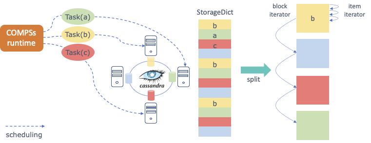

.. _pycompss:

Support to automatic parallelization: PyCOMPSs
==============================================

COMPS Superscalar is a framework which aims to ease the development and execution of applications for distributed infrastructures, such as Clusters, Grids and Clouds. This framework implements several bindings to support applications written in different languages. COMPSs runtime exports an interface to implement some optimizations regarding the data storage that for example can be used to enhance data locality. Here we only introduce the main features implemented by Hecuba to interact with COMPSs and, in particular, with the Python binding (from now on, PyCOMPSs); more Documentation about this can be found in the
`COMPSs Manual <https://compss.bsc.es/releases/compss/latest/docs/COMPSs_User_Manual_App_Development.pdf>`_.

Tasks in PyCOMPSs
*****************

PyCOMPSs allow programmers to write sequential code and to indicate, through a decorator, which functions can be executed in parallel. The COMPSs runtime interprets this decorator and executes, transparent to the programmer, all the code necessary to schedule each task on a computing node, to manage dependencies between tasks and to send and to serialize the parameters and the returns of the tasks.

When input/output parameters of a tasks are persistent objects (i.e. their classes implement the Storage API defined to interact with PyCOMPSs), the runtime asks the storage system for the data locality information and uses this information to try to schedule the task on the node containing the data. This way no data sending or serialization is needed.

The following code shows an example of PyCOMPSs task. The input parameter of the task could be an object resulting from splitting a StorageDict. In this example the return of the task is a Python dictionary.

.. code-block:: python

    @task(returns = dict)
    def wordcountTask(partition):
        partialResult = {}
        for word in partition.values():
            if word not in partialResult:
                partialResult[word] = 1
            else:
                partialResult[word] = partialResult[word] + 1
        return partialResult

